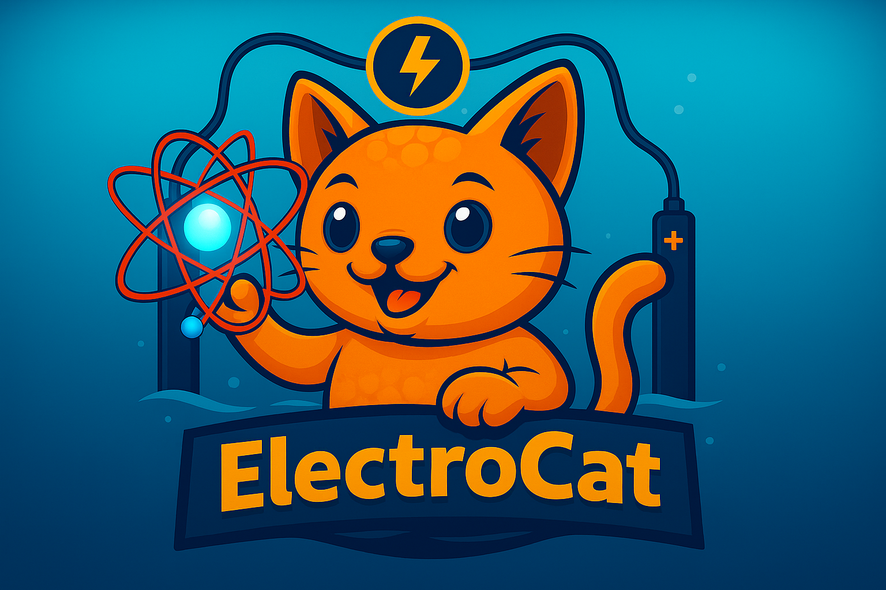

# ⚡ ElectroCat

**ElectroCat** (aka `ecat`) is a Python toolkit for analyzing molecular and surface electrocatalysts under explicit solvation and ionic conditions.

Whether you're studying molecular catalysts, extended surfaces, or hybrid systems, ElectroCat provides flexible tools to decode complex electrochemical environments.

---

## 📦 Features

- Support for **molecular**, **surface**, and **hybrid** catalyst systems

- Interfaces for solvation-aware structural analysis

- Support for ions (e.g., H⁺, OH⁻, Na⁺, Cl⁻), electric-field and polarization effects

---

## 🚀 Getting Started

👉 Check out the [Installation Guide](https://skethirajan.github.io/ecat/user/install/)

📚 Browse the [User Guide](https://skethirajan.github.io/ecat/user/intro/)

🧑‍💻 See [Code Reference](https://skethirajan.github.io/ecat/reference/)

---

## ⚖️ License

`ecat` is released under a [BSD 3-Clause license](https://github.com/skethirajan/ElectroCat/blob/main/LICENSE).

---
