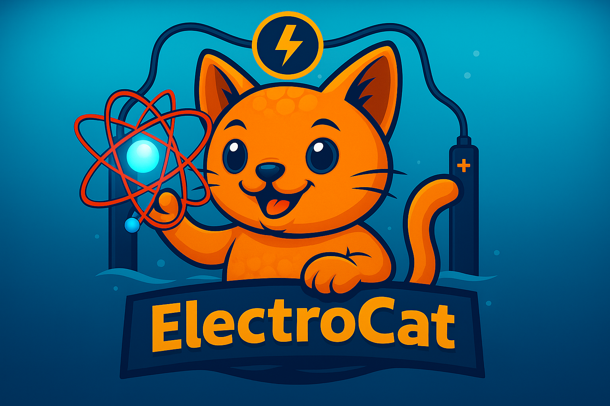

# **ElectroCat** ⚡

**ElectroCat** (or **ecat**) is a Python toolkit for analyzing molecular and surface electrocatalysts under explicit solvation and ionic conditions.

Whether you're studying molecular catalysts, extended surfaces, or hybrid systems, ElectroCat provides flexible tools to decode complex electrochemical environments with atomistic resolution.

👉 Dive into the [Installation Guide](user/install.md) or explore the [User Guide](user/intro.md) to get started.

---

